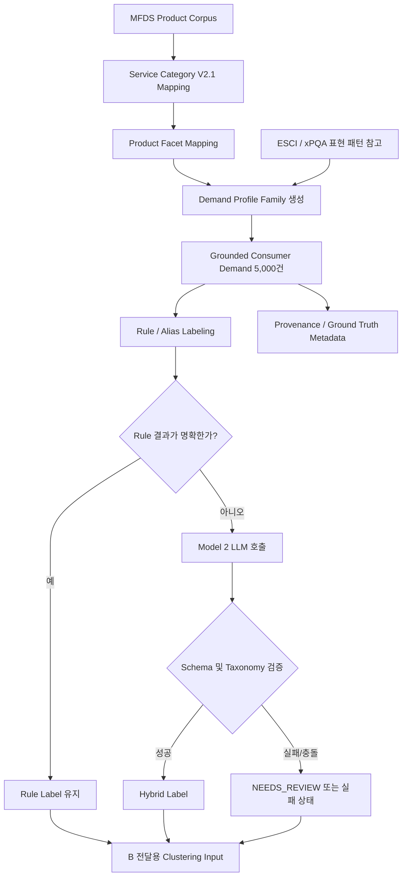

# Consumer Demand Labeling 흐름

## 방식별 분기

| 방식 | 입력 범위 | 처리 방식 | 결과 용도 |
| --- | --- | --- | --- |
| Rule Baseline | 5,000건 전체 | Alias와 규칙으로 Facet Code를 해석 | 빠른 기준선, 전체 배치 |
| Model Only | 대표 Sample 200건 | Model 2가 `extra_requirement`를 Facet으로 해석 | 실제 모델 동작과 실패 확인 |
| Hybrid | 5,000건 전체 | Rule 성공은 유지하고 검토 대상만 Model 호출 | B 전달용 안정적 후보 |

## B 전달 경계

`clustering_input_grounded_5000_v1.csv`에는 Clustering에 필요한 Feature와 상태만 둡니다.

`profile_id`, `expected_facet_profile`, `generation_parent_id` 같은 생성·평가용 값은 `clustering_ground_truth_metadata_5000_v1.csv`에 분리합니다. 이 Metadata를 Cluster Feature로 사용하면 데이터 생성 조건이 결과에 새어 들어가므로 금지합니다.
